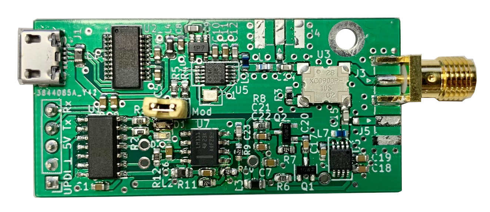

# Detector Reader
Short range, low cost UHF RFID reader based on RF detector

## Features
- 0.5m...2m read range depending on antenna and tag (8dBi patch antenna recommended)
- Monostatic or bistatic configuration
- ~15$ of production cost
- Compact size of 52x25mm
- Powersupply via 5V/USB
- EPCs are reported via UART or USB (serial) interface (115200 baud)

## Flashing
The firmware is written in AVR-C for ATtiny814 (tinyAVR 1-series with UPDI). An AVR-C toolchain for compiling is, e.g., included in the Arduino IDE. 
- Get the AVR-C toolchain and modify your systems `PATH` variable to look in its *bin/* directory
- Install `make` if you have it not already (e.g. for Windows: http://gnuwin32.sourceforge.net/packages/make.htm) and ensure its binary can be found from your `PATH` variable
- Get a USB-UART adapter, connect its RX and TX with a 1k resistor and connect RX to the UPDI pin of the board, (and 5V and GND of course)
- Install [pyupdi](https://github.com/mraardvark/pyupdi)
- In the firmware directory, edit `PROGRAMMER = /dev/tty.usbserial-A50285BI` in the *Makefile* to match your USB-UART adapter, then run `make flash clean`

## Notes
- In the current design, the transmitter is activated and modulated by a simple TTL signal, but the power is limited to 13dBm. It would be possible to control it via SPI and increase its power to 16dBm (and tune frequency) though
- Due to the detector-based design (no I/Q, no phase information), the detection of tags varies periodically with the distance, so it works better when the tag or reader is moving
- Have a look in the branches for alternative LF amplification and filtering of the demodulated signal