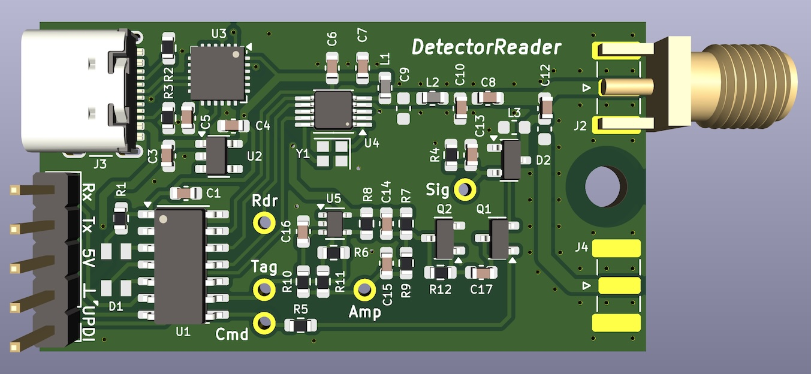

# Detector Reader
Short range, low cost UHF RFID reader based on RF detector



## Features
- 0.5m...2m read range depending on antenna and tag (8dBi patch antenna recommended)
- Monostatic or bistatic configuration
- ~15$ of production cost
- Compact size of 46x25mm
- Powersupply via 3...5V or USB
- EPCs are reported via UART or USB (serial) interface (115200 baud)

## Flashing
The firmware is written in AVR-C for the ATtiny814 using the platformIO IDE (extension for Visual STudio Code).

To transfer the firmware to the microcontroller, install [pymcuprog](https://pypi.org/project/pymcuprog/) and build yourself a UPDI programmer from a simple USB-UART converter and a 1kOhm resistor by connecting the resistor between Rx und Tx and connecting Rx to UPDI (Reset pin):
```
                        Vcc                     Vcc
                        +-+                     +-+
                         |                       |
 +---------------------+ |                       | +--------------------+
 | Serial port         +-+                       +-+  AVR device        |
 |                     |     +----------+          |                    |
 |                  TX +-----+   1k     +-----+    |                    |
 |                     |     +----------+     |    |                    |
 |                     |                      |    |                    |
 |                  RX +----------------------+----+ UPDI               |
 |                     |                           |                    |
 |                     +--+                     +--+                    |
 +---------------------+  |                     |  +--------------------+
                         +-+                   +-+
                         GND                   GND
```

## Known issues
Depending on the antenna impedance, a voltage of > 3V might be present on *SIG* (detector diode output). If this is the case, the signal does not gets forwarded by Q1 as its base voltage is 3V at maximum (from GPIO). To fix this, either
- short C and E of Q1 (which will disable reader command modulation muting), 
- place a low impedance on L3 placeholder (can be a resistor too, try 100 Ohm), 
- or lower R4.